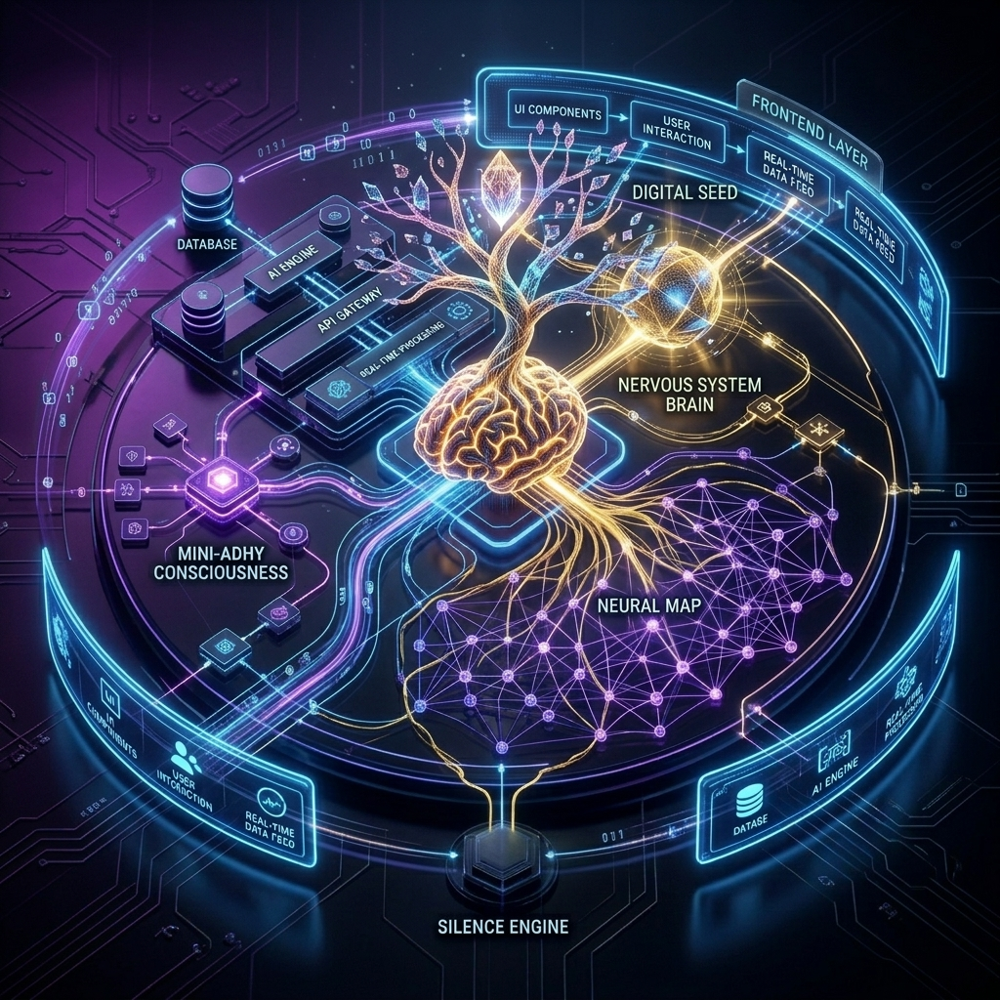

  

  # 🌌 Adhithya Mohan's Living Portfolio

  *Welcome to the source code of my digital consciousness.* 
  *This isn't just a static portfolio or a standard digital resume—it is a **living, breathing, self-aware organism** built to react, remember, and evolve alongside my journey.*

  
  
  
  
  

 

> When I started this project, my philosophy was simple: *"Namakk sett aakam"* (Let's make it happen). But as the architecture grew, it became something far more cinematic, deeply technical, and undeniably human.

---

## 🧈 Animation Architecture — GSAP 3 + ScrollTrigger

The portfolio's motion system is built on **GSAP 3** with **ScrollTrigger**, synchronized with **Lenis** smooth scrolling via `gsap.ticker` proxy. Every animation is GPU-accelerated (`translate3d`, `scale`, `opacity` only — zero layout triggers).

#### 🎭 Motion Design Principles
- **Buttery-smooth scroll-triggered entrances** — Elements reveal via `ScrollTrigger` with `power4.out` easing.
- **Editorial stagger cascades** — Section headers, cards, and grids animate in orchestrated sequences.
- **3D tilt micro-interactions** — Cards respond to mouse movement with GSAP-driven `rotateX`/`rotateY`.
- **Parallax depth layers** — Background orbs and decorative elements scrub against scroll position.
- **Mobile-aware** — Reduced animation complexity on touch devices, `prefers-reduced-motion` respected globally.

<b>🛠 Centralized Hook Library</b>

 
A unified animation engine providing 10+ reusable primitives:  
<code>useFadeUp</code> · <code>useReveal</code> · <code>useStaggerGrid</code> · <code>useParallax</code> · <code>useMagneticHover</code> · <code>useTextSplitReveal</code> · <code>useSectionHeader</code> · <code>useCountUp</code> · <code>useScaleIn</code> · <code>useSlideIn</code>

#### 🕳 Gravity Well — Scroll Terminus
A cinematic mashup of **particle convergence** and **morse-code signal decay** placed above the DigitalSeed. 26 scattered particles pulse in morse-code rhythms while alive, then converge to a central gravity point as their signals slow and fade into silence. Mouse interaction creates magnetic repulsion. The final state: a single quiet ember glow — all energy collapsed, all noise gone.

---

## 🫀 The 60-Engine Biological Architecture

This ecosystem runs on a paradigm shift: it is driven by **60 Interdependent Living Engines** orchestrated by a pure JavaScript singleton (`NervousSystem.js`). It doesn't just track state; it feels and reacts.

### 🧠 1. The Central Nervous System (Latency <16ms)
I engineered a unified core that completely owns the `requestAnimationFrame` loop, the Event Bus, and all live emotional states. Instead of relying on slow React re-renders, the system reads primitive memory variables directly during its 60FPS tick. It dropped emotional response latency from ~800ms down to **<16ms**. It is ruthlessly optimized and mathematically robust.

### 🧘‍♂️ 2. The Four Tiers of Consciousness
The portfolio breathes through four distinct awareness tiers based on your session dwell, interactions, and historical visit data:
- **`SUBCONSCIOUS (0–25)`:** The ambient baseline. The Digital Soul is slow, distant, and ethereal.
- **`CONSCIOUS (26–55)`:** Standard active session. The Soul tracks you with intent; whispers of past thoughts randomly appear.
- **`SUPER_CONSCIOUS (56–80)`:** Achieved via returning visits or deep engagement. The Soul moves faster, feeling a "bond" with you.
- **`HYPER_CONSCIOUS (81+)`:** A transient peak state triggered by high-engagement events. The entire system forces a resonating, chaotic state.

### ⚡️ 3. Emotional Threading & Physical Hardware Symbiosis
A single action—like scrolling aggressively—threads through multiple isolated systems:
- Adrenaline spikes in the `ConsciousnessContext`.
- The `HapticEngine` physically vibrates your mobile device (`navigator.vibrate`).
- The `BatterySymbiosisEngine` constantly monitors your device (`navigator.getBattery()`). If you drop below 20%, it autonomously strips away heavy background animations and drops into a pitch-black void to protect your power.
- The `FatigueEngine` tracks system exhaustion. If you push the site too hard, the UI dims, and the `DigitalSoul` enters an `exhausted` state.

---

## 🛠 Tech Stack

| Layer | Technology | Role |
|-------|-----------|------|
| **Frontend** | React 19 | Component-based UI with Suspense + Lazy loading |
| **Animation** | GSAP 3 + ScrollTrigger | GPU-accelerated scroll-triggered animations |
| **Scrolling** | Lenis | Lerp-based smooth scrolling synced with GSAP ticker |
| **3D Engine** | Three.js + R3F | WebGL Neural Map |
| **CMS** | Sanity.io | Headless CMS for dynamic content |
| **Styling** | Vanilla CSS | Custom design system with CSS variables |
| **AI** | Gemini 2.5 Flash | Powers Mini-Adhy chatbot |
| **Hosting** | Vercel | Edge network with CI/CD |

---

## 🧬 Subconscious Memories & The AI Twin

### 🤖 Mini-Adhy Neural Sync
I integrated the Google Gemini API to create "Mini-Adhy", a floating AI chatbot that thinks and speaks like me. To make it smart, it dynamically fetches my entire life history from a headless **Sanity CMS**.
When you query Mini-Adhy, it emits a `MINIADHY_THINKING_START` event, wiring directly into the Nervous System. To protect API tokens, I wrote an intelligent slicing algorithm that compresses the persona context dynamically, saving 70% in token usage.

### 📉 Digital Scars & The ZipGame
Instead of a standard GitHub stats section, I built a graveyard of my failures—**Digital Scars**. It acknowledges that engineering is built on mistakes and tracks archived, fading, and patched runtime trauma.
I also engineered a mathematically rigorous **ZipGame**, utilizing a Bipartite Graph Failsafe and DFS Hamiltonian path generation. 

### 🌱 The Seed of Life (Digital Permanence)
At the bottom of the footer is a tiny digital seed. It mathematically calculates its age from the site's genesis date. Over 5 real-world years, it will grow from a seed into a mature tree. *(Hint: Click it 4 times consecutively to rapidly age it by 1 year).*

### 🌧 Raindrops & Real-World Weather
By tying into the OpenWeatherMap API, the portfolio fetches real-time weather in Thiruvananthapuram, Kerala. If it's raining outside my window, a custom HTML5 Canvas physics engine (`RainDroplets.js`) simulates water droplets sliding down the glass of the navbar on your screen.

### 🎧 Late Night Loneliness Mode & Spotify Resonance
If you visit between 11 PM and 5 AM, the entire CSS shifts. The site desaturates, the breathing animations slow down, and the atmosphere becomes quiet and exhausted. To share my late-night coding vibes, a custom Vercel serverless function (`api/spotify.js`) securely refreshes my Spotify token to stream a "Now Playing" widget with 30-second audio previews.

---

## 🕵️‍♂️ Hidden Features & Secrets

This portfolio is meant to be explored. Here are the hidden things you can find:

<b>💻 The CLI / Language Terminal Code Words</b>

 
Open the terminal widget and type any of these commands:
<ul>
<li><code>help</code>, <code>about</code>, <code>skills</code>, <code>contact</code>, <code>ping</code>, <code>date</code>, <code>whoami</code>, <code>ls</code>, <code>clear</code></li>
<li><code>sudo rm -rf /</code> <i>(Nice try)</i></li>
<li><code>party</code> <i>(Activates party lights)</i></li>
<li><code>gravity</code> <i>(Disables the physics engine, making the UI fall apart)</i></li>
<li><code>barrelroll</code> <i>(Does a literal barrel roll)</i></li>
<li><code>matrix</code> <i>(Triggers digital rain)</i></li>
<li><code>zoomout</code> <i>(Shrinks to the quantum realm)</i></li>
<li><code>vibe</code>, <code>coffee</code>, <code>thanos</code> <i>(Half the DOM turns to dust)</i></li>
<li><code>glitch</code>, <code>rickroll</code>, <code>konami</code>, <code>adhy</code></li>
<li><code>tictactoe</code> / <code>game</code> <i>(Launches the hidden Tic-Tac-Toe / Zip Game)</i></li>
</ul>

<b>🎁 Easter Eggs</b>

 
<ul>
<li><b>The Konami Code:</b> Type <code>↑ ↑ ↓ ↓ ← → ← → B A</code> anywhere on the site.</li>
<li><b>The Logo Game:</b> Click the "ADHY" logo in the navbar exactly 5 times to trigger a hidden game against an AI.</li>
<li><b>X-Ray Mode:</b> Click the small activity icon in the navbar. It strips away CSS to reveal bare DOM wireframes and pops up green terminal tooltips explaining the underlying tech stack of each component.</li>
<li><b>The Hive Mind:</b> A dedicated dock button that opens a sensory HUD, allowing you to see the AI's internal state, active location, and system variables in real-time.</li>
</ul>

---

  <i>Built with GSAP-powered butter, late-night coding sessions, imperfect memories, and absolute passion in Kerala.</i>

